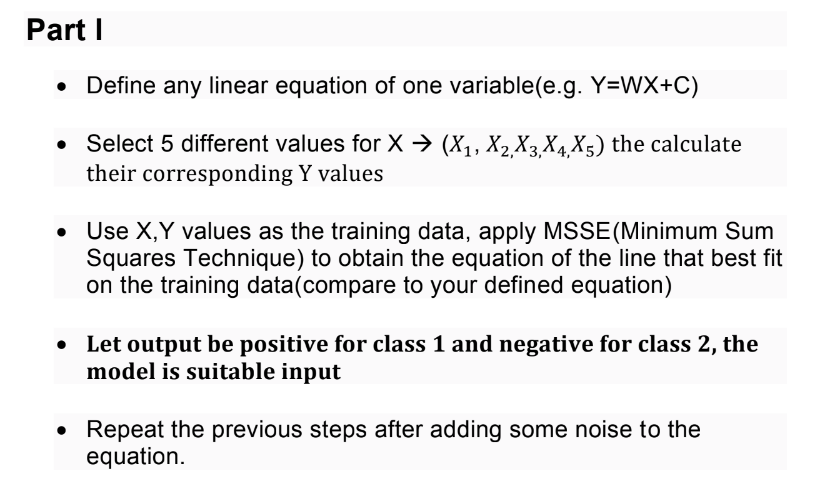

# Linear Regression with Minimum Sum Squares Technique

This code demonstrates how to perform linear regression using the Minimum Sum Squares Technique (MSSE) to obtain the equation of the line that best fits a set of training data points. It also includes a section to add noise to the data and observe its effect on the regression model.

### -----------------------------------------------------------------------------------------------------------------

## Code Explanation

- The code is written in Python and utilizes libraries such as NumPy and Matplotlib.
- It generates random values for \( X \) and calculates corresponding \( Y \) values based on the original linear equation.
- Linear regression is performed using MSSE to obtain the best-fit line for the training data.
- The process is repeated with added noise to observe its effect on the regression model.

## Instructions for Running the Code

1. Ensure you have Python installed on your system.
2. Install the required libraries (`numpy`, `matplotlib`) if not already installed.

